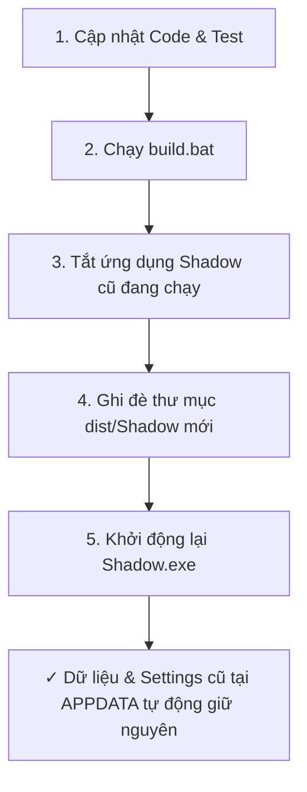

# Hướng Dẫn Đóng Gói, Bảo Trì & Quy Trình Nâng Cấp Ứng Dụng Shadow Assistant

> **Vị trí tài liệu**: `client/plans/packaging_and_maintenance_guide.md`  
> **Mục đích**: Tài liệu hóa quy trình đóng gói file thực thi độc lập (`.exe`), cách cập nhật phiên bản mới mà không làm mất dữ liệu người dùng, quy trình sao lưu (Backup/Restore) và quy trình gỡ cài đặt sạch sẽ (Clean Uninstall).

---

## 1. Tổng Quan Kiến Trúc Đóng Gói (Packaging Architecture)

Ứng dụng **Shadow Desktop Assistant** được xây dựng trên nền tảng **Python + PyQt6**. Khi đóng gói bằng **PyInstaller**, cấu trúc ứng dụng được chia thành 2 phần tách biệt rõ ràng theo tiêu chuẩn Windows:

```
+-------------------------------------------------------------------+
| 1. THƯ MỤC CÀI ĐẶT ỨNG DỤNG (Application Binary - Read Only)      |
|    Vị trí: dist\Shadow\ (hoặc C:\Program Files\Shadow\)           |
|                                                                   |
|    ├── Shadow.exe          (File thực thi chính)                  |
|    ├── python313.dll       (Embedded Python Runtime)              |
|    ├── PyQt6\              (Qt Libraries & Plugins)               |
|    ├── client\ui\styles.qss (Giao diện Apple Dark)                |
|    └── _internal\          (Thư viện phụ thuộc: Pillow, mss, v.v.)|
+-------------------------------------------------------------------+
                                 │
                                 │ Đọc/Ghi dữ liệu runtime
                                 ▼
+-------------------------------------------------------------------+
| 2. THƯ MỤC DỮ LIỆU NGƯỜI DÙNG (User Data & Settings - Read/Write) |
|    Vị trí: %APPDATA%\AI Desktop Assistant\                        |
|    (C:\Users\<Username>\AppData\Roaming\AI Desktop Assistant\)    |
|                                                                   |
|    ├── .env                     (Webhook URL, Port, API Key)      |
|    ├── scripts_config.json      (Danh sách scripts tự động hóa)   |
|    ├── hotkeys_config.json      (Phím tắt cá nhân hóa)            |
|    ├── screenshot_config.json   (Thông số chụp màn hình, chất lượng)|
|    └── notification_queue.json  (Hàng đợi thông báo khi mute)     |
+-------------------------------------------------------------------+
```

---

## 2. Hướng Dẫn Đóng Gói Ứng Dụng (.exe)

### 2.1. Yêu cầu Tiên quyết (Prerequisites)
- Đã cài đặt Python 3.10+ trên máy tính.
- Đã cài đặt đầy đủ dependencies:
  ```bash
  pip install -r requirements.txt
  ```

### 2.2. Quy trình Đóng gói 1-Click (Khuyên dùng ⭐)
Trong thư mục gốc của dự án, nhấp đúp chạy file **`build.bat`** (hoặc chạy qua Terminal):
```cmd
build.bat
```

Script sẽ tự động thực hiện:
1. Kiểm tra và cài đặt `pyinstaller` nếu chưa có.
2. Dọn dẹp các cache build cũ (`--clean`).
3. Đọc cấu hình từ `shadow.spec` để gom tài nguyên và biên dịch.
4. Xuất file thực thi hoàn chỉnh tại: **`dist\Shadow\Shadow.exe`**.

---

### 2.3. Quy trình Đóng gói Thủ công qua Lệnh Terminal
Nếu bạn muốn build trực tiếp bằng command line:
```bash
python -m PyInstaller --noconfirm --clean shadow.spec
```

---

## 3. Quy Trình Nâng Cấp Phiên Bản Mới (Update Workflow)

Khi bạn có những thay đổi mã nguồn mới (thêm tính năng, sửa bug UI, đổi logic n8n) và muốn cập nhật ứng dụng:



### Các bước cụ thể:
1. **Kiểm tra cú pháp**: Chạy test để đảm bảo không có lỗi code:
   ```bash
   python -m py_compile client/main.py client/config.py
   ```
2. **Build bản mới**: Chạy `build.bat`.
3. **Thoát app cũ**: Click chuột phải vào icon Tray -> Chọn **Quit** (hoặc dùng Task Manager).
4. **Phân phối / Sử dụng**: Thư mục `dist\Shadow` mới đã sẵn sàng. Khi khởi chạy, `Shadow.exe` sẽ tự động kết nối lại toàn bộ cấu hình cũ tại `%APPDATA%\AI Desktop Assistant\` mà không yêu cầu bạn phải cài đặt lại từ đầu!

---

## 4. Workflow Sao Lưu & Phục Hồi Cấu Hình (Backup & Restore)

Để đảm bảo bạn không bao giờ mất danh sách script, phím tắt hoặc cấu hình n8n khi chuyển máy hoặc cài lại Windows:

### 4.1. Sao lưu Cấu hình (Backup)
Chạy file **`tools\backup_settings.bat`** (hoặc lệnh Python):
```cmd
tools\backup_settings.bat
```
- Script sẽ tự động đóng gói toàn bộ file `.json` và `.env` từ `%APPDATA%\AI Desktop Assistant\` thành 1 file nén có gắn timestamp:  
  `backups\shadow_backup_YYYYMMDD_HHMMSS.zip`

### 4.2. Phục hồi Cấu hình (Restore)
Để khôi phục cấu hình từ file backup bất kỳ:
```bash
python tools/backup_settings.py --restore backups/shadow_backup_20260823_221500.zip
```

---

## 5. Workflow Gỡ Cài Đặt Sạch Sẽ (Clean Uninstall)

Khi bạn muốn xóa hoàn toàn Shadow Assistant khỏi hệ thống mà không để lại rác:

Chạy file **`tools\uninstall.bat`**:
```cmd
tools\uninstall.bat
```

Script sẽ tự động thực hiện 4 bước an toàn:
1. **Dừng tiến trình**: Đóng tất cả các tiến trình `Shadow.exe` hoặc python đang chạy ngầm.
2. **Xóa Khởi động cùng Windows**: Gỡ bỏ khóa đăng ký trong Windows Registry (`HKCU\Software\Microsoft\Windows\CurrentVersion\Run`).
3. **Tự động sao lưu an toàn**: Tạo 1 bản backup vào thư mục `backups/` trước khi xóa thư mục `%APPDATA%\AI Desktop Assistant\`.
4. **Dọn dẹp thư mục Build**: Xóa các thư mục `dist/` và `build/`.

---

## 6. Xử Lý Các Vấn Đề Thường Gặp (Troubleshooting)

| Vấn đề | Nguyên nhân | Cách khắc phục |
| :--- | :--- | :--- |
| **Lỗi `error code: 1409`** | Có 1 tiến trình Shadow cũ đang chạy ngầm giữ phím tắt | Mở Task Manager tắt `Shadow.exe` / `python.exe` hoặc chạy `tools\uninstall.bat` |
| **Không tìm thấy `.env` khi chạy `.exe`** | Chưa cấu hình file `.env` | Copy file `.env` đặt cùng thư mục với `Shadow.exe` hoặc đặt vào `%APPDATA%\AI Desktop Assistant\.env` |
| **Bật lên hiện cửa sổ đen CMD** | Cấu hình spec để `console=True` | Kiểm tra file `shadow.spec` đảm bảo `console=False` |
| **Mất icon hoặc style giao diện** | Đường dẫn tài nguyên tĩnh bị thiếu | Kiểm tra biến `datas` trong file `shadow.spec` đã bao gồm `styles.qss` |
